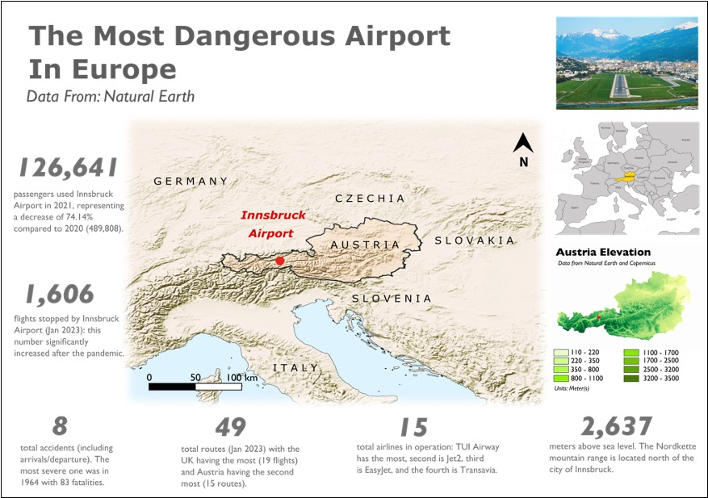
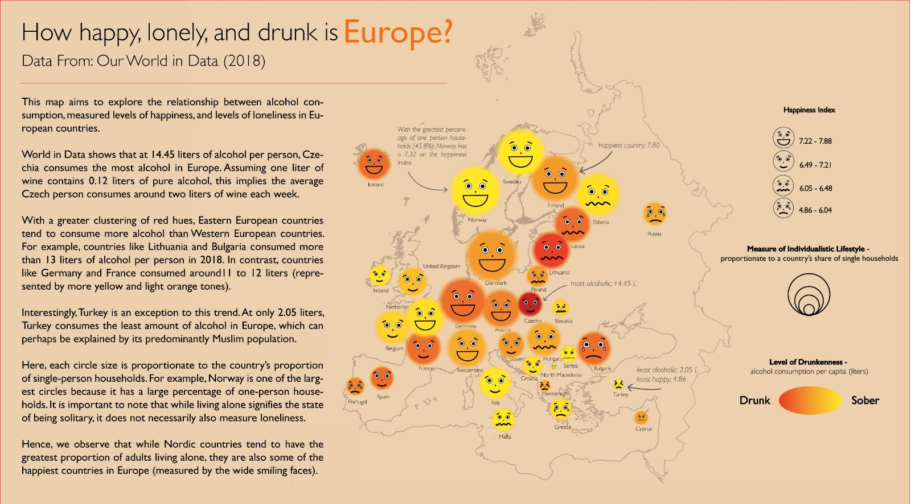

# Welcome to Our Codebase! 🗺

### This is a repository for all the code and materials used to make our maps and visualizations for the class GEOG0162 Cartography and Data Visualization at University College London.

Every week, we worked as a group to create a map or data visualization on an assigned topic. We use a lot of R and QGIS for data wrangling and GIS; Blender for 3D visualizations and Illustrator to put everything together. All the data we used are open-source or publicly available.

Here's what we produced each week:

| Theme                                                                                                                        | Visualisation                                                                             |
|---------------------------------------------|--------------|
| "Using a dataset of your choice for the UK\* create a map that highlights a societal inequality."                            |                                                       |
| "Create a map/graphic of COVID-19 cases or deaths that would be suitable for a government briefing to the public."           |                                                                  |
| "Using data from Natural Earth create a map that reflects the core principles of visual hierarchy and design"                |                                                                 |
| "Create a map using a dataset of your choice from the Humanitarian Data Exchange (HDX)."                                     |                                                              |
| "Using the NASA fire data introduced above create a map that showcases at least two different map projections."              |                                                                |
| "Taking one of the datasets you have mapped already, create a new map from it but with a much improved basemap for context." |                                                                |
| "Using a dataset of your choice from Our World in Data create two compelling charts (each of a different type)."             |   |
| "Using a dataset of your choice from Our World in Data create two compelling charts (each of a different type)."             | [.jpg)](https://matthewgarethlam.github.io/cartography_2023_week10/) |
