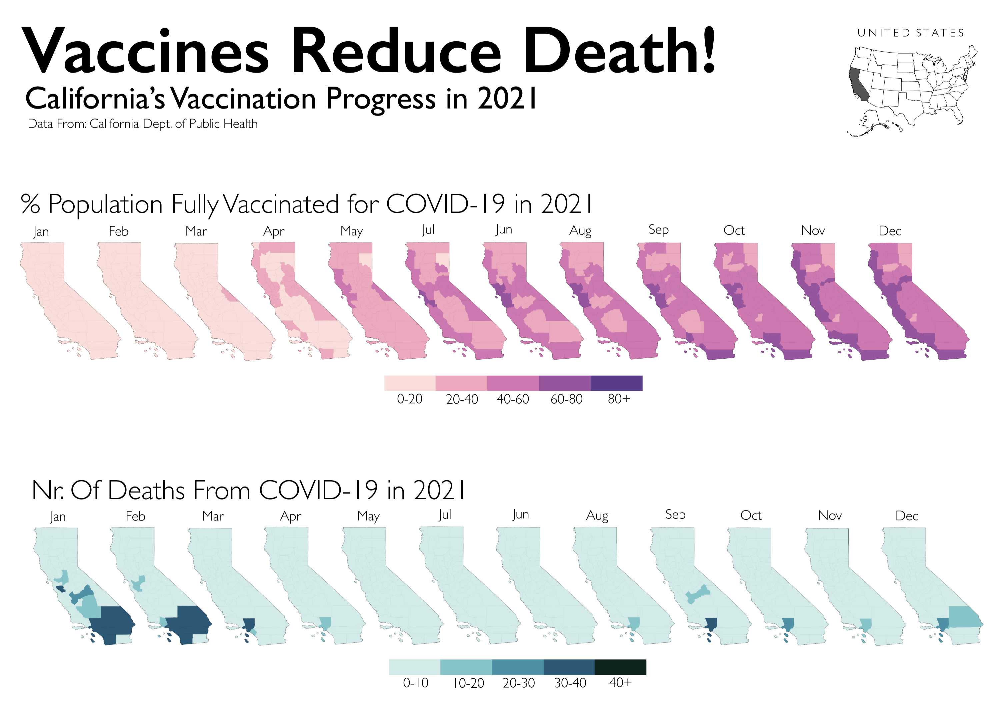
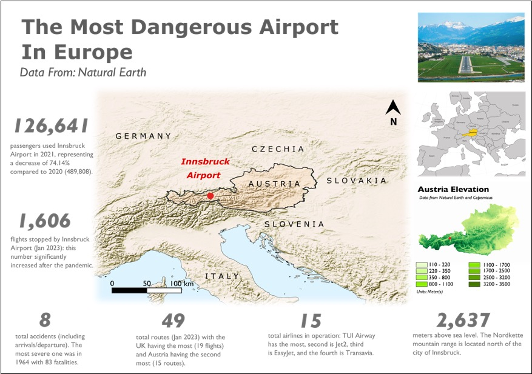
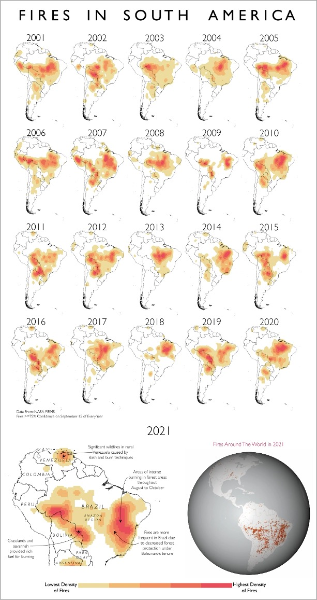
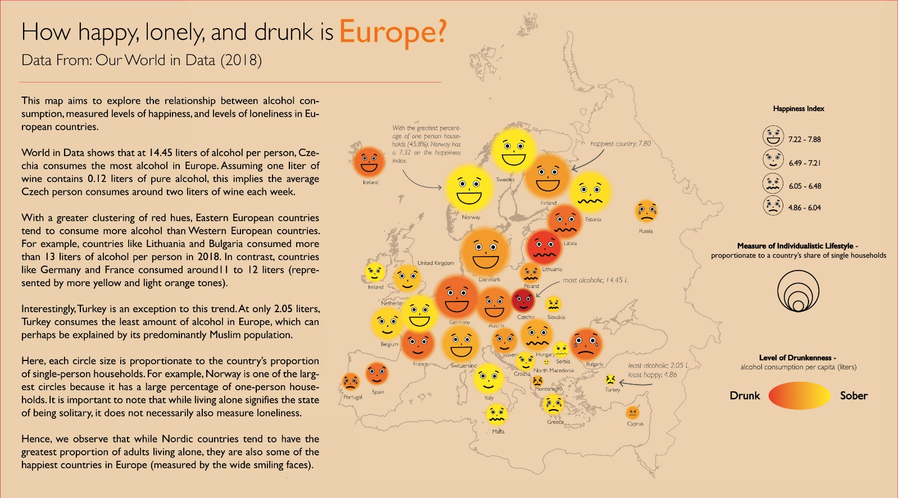

# Welcome to Our Codebase! 🗺

### This is a repository for all the code and materials used to make our maps and visualizations for the class GEOG0162 Cartography and Data Visualization at University College London.

Every week, we worked as a group to create a map or data visualization on an assigned topic. We use a lot of R and QGIS for data wrangling and GIS; Blender for 3D visualizations and Illustrator to put everything together.

The themes for each week are:

+-------------+---------------------------------------------------------+
| Week 2:     |                     |
+-------------+---------------------------------------------------------+
| Week 3:     |                                |
+-------------+---------------------------------------------------------+
| Week 4:     |                               |
+-------------+---------------------------------------------------------+
| Week 5:     |                            |
+-------------+---------------------------------------------------------+
| Week 7:     |                              |
+-------------+---------------------------------------------------------+
| Week 8:     |                            |
+-------------+---------------------------------------------------------+
| Week 10     |                                |
|             |                                                         |
|             |  |
+-------------+---------------------------------------------------------+
