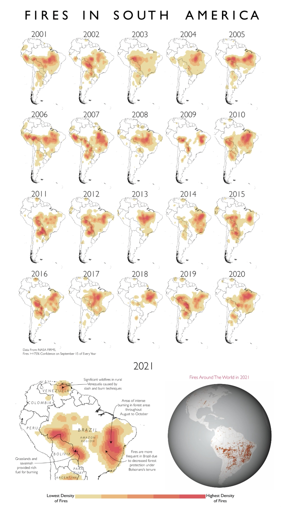

# Welcome to Our Codebase! 🗺

### This is a repository for all the code and materials used to make our maps and visualizations for the class GEOG0162 Cartography and Data Visualization at University College London.
By: Matthew Lam, Chelsea Ju, Yilin Xu, Eddie Houghton

Every week, we worked as a group to create a map or data visualization
on an assigned topic. We use a lot of R and QGIS for data wrangling and
GIS; Blender for 3D visualizations and Illustrator to put everything
together. All the data we used are open-source or publicly available.

Here’s what we produced each week:

| Theme                                                                                                                        | Visualisation                                                                             |
|------------------------------------------------------|------------------|
| “Using a dataset of your choice for the UK\* create a map that highlights a societal inequality.†                           |                                                       |
| “Create a map/graphic of COVID-19 cases or deaths that would be suitable for a government briefing to the public.†          |                                                                  |
| “Using data from Natural Earth create a map that reflects the core principles of visual hierarchy and design†               |                                                                 |
| “Create a map using a dataset of your choice from the Humanitarian Data Exchange (HDX).†                                    |                                                              |
| “Using the NASA fire data introduced above create a map that showcases at least two different map projections.†             |                                                                |
| “Taking one of the datasets you have mapped already, create a new map from it but with a much improved basemap for context.†|                                                                |
| “Using a dataset of your choice from Our World in Data create two compelling charts (each of a different type).†            |   |
| “Using a dataset of your choice from Our World in Data create two compelling charts (each of a different type).†            | [.jpg)](https://matthewgarethlam.github.io/cartography_2023_week10/) |
